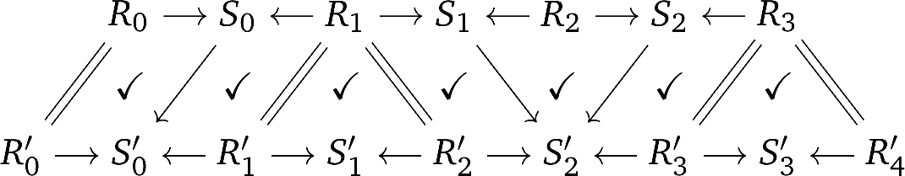
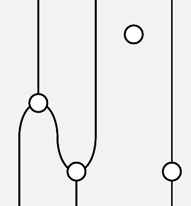
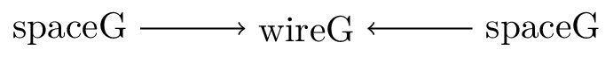
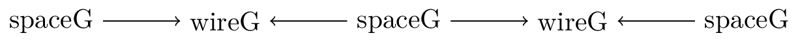
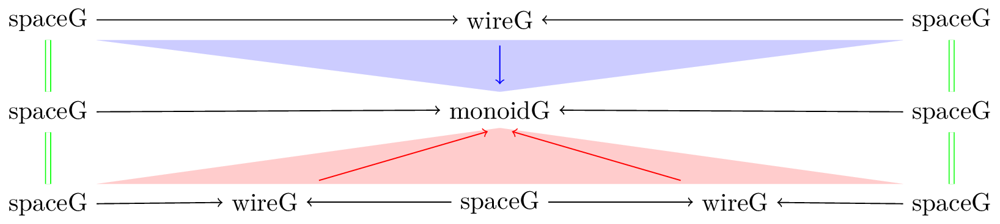
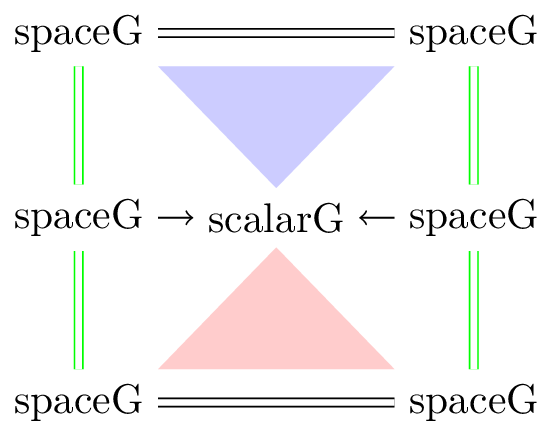
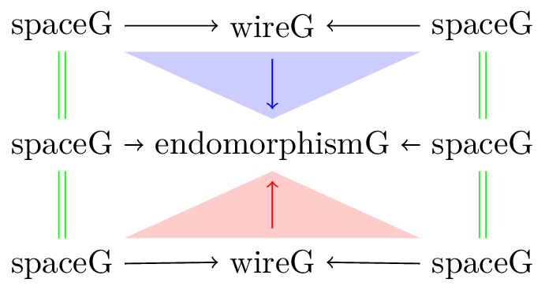
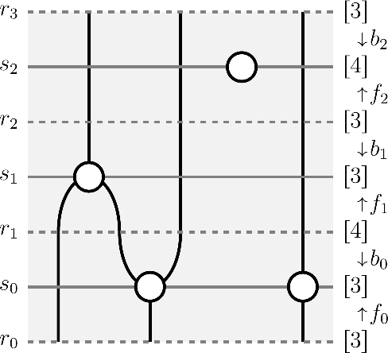

# Build instructions

1. install
   [purescript](https://github.com/purescript/purescript/blob/master/INSTALL.md)
   compiler and [spago](https://github.com/purescript/spago#installation)
   build tool:
    * `nix-shell` can do this for you with the provided
      [`shell.nix`](https://github.com/NickHu/homotopy-core/blob/master/shell.nix)
    * alternatively, both of these dependencies can be installed with `npm
      install -g purescript spago`
2. run `spago build` in the core and webclient directories

## Tooling

[purty](https://gitlab.com/joneshf/purty) is used to format the code in
this repository, and this is incorporated as a git
[pre-commit](https://github.com/NickHu/homotopy-core/blob/master/.githooks/pre-commit)
hook (please install with `git config core.hooksPath .githooks`).

[purescript-language-server](https://github.com/nwolverson/purescript-language-server)
provides IDE-like features via the [Language Server
Protocol](https://microsoft.github.io/language-server-protocol). Among
other features, this provides facilities to:

* trigger builds (e.g.\ on save) --- this is vastly preferred to running
  `spago build`;
  + diagnostics information (warnings, errors) resulting from the build
    are passed back to the editor
* apply compiler suggestions to fix warnings;
* provide autocompletion of symbols from installed packages;
  + automatically adding the corresponding `import` line afterwards
* provide information about a symbol on hover (type, documentation);
* provide refactoring tools;
* auto-insert case splits.

# Data structure overview

In this library, we encode zigzags in the `Diagram` type:

```purescript
data Diagram
  = Diagram0 Generator
  | DiagramN DiagramN

newtype DiagramN
  = InternalDiagram { source :: Diagram, cospans :: List Cospan }
```

`Diagram` is a sum type which distinguishes between $0$-dimensional diagrams
and $>0$-dimensional diagrams. A $0$-dimensional diagram is merely a
`Generator` (an element of the signature), whereas for $n >0$, a
$n$-dimensional diagram is given by its source boundary (A $n-1$-dimensional
diagram), and a list of `Cospan`s:

```purescript
type Cospan
  = { forward :: Rewrite, backward :: Rewrite }

data Rewrite
  = Rewrite0 { source :: Generator, target :: Generator }
  | RewriteI
  | RewriteN { dimension :: Int, cones :: List Cone }

type Cone
  = { index :: Int
    , source :: List Cospan
    , target :: Cospan
    , slices :: List Rewrite
    }
```

A `Cospan` encodes a cospan comprising of:
  * a singular level $sᵢ$ --- the tip of the cospan;
  * zigzag maps $rᵢ \xrightarrow{\texttt{forward}} sᵢ
    \xleftarrow{\texttt{backward}} r_{i+1}$.

`Rewrite` similarly encodes maps between diagrams (zigzag maps), with identity
rewrites being represented by `RewriteI`. A rewrite between $0$-dimensional
diagrams simply maps `Generator`s to `Generator`s (`Rewrite0`). A
$>0$-dimensional rewrite (`RewriteN`) is a non-trivial zigzag map, which is
sparsely encoded as a list of `Cone`s.

Recall that in general, a zigzag map $f\colon Z → Z′$ is given by:
  * a monotone function from the singular levels of $Z$ to the singular levels
    of $Z′$;
  * built from morphisms of $𝒞$ (if we are working in the category $Z_𝒞$ ---
    zigzags of $𝒞$);
  * identities between regular levels;
  * such that all squares commute.



A `Cone` is a sparse encoding of the monotone functions between singular
levels. Suppose that we have a monotone function from a linearly ordered set
with $m$ elements (denoted $[m]$) to one with $n$ elements: $[m]
\xrightarrow{f} [n]$; this can be decomposed into a sequence of `Cone`s as follows:

## An example

Let us see how we can encode the following string diagram:



When an $n$-dimensional diagram is projected onto 2D, the $n$-cells are
represented as vertices, the $n-1$-cells as edges, and the $n-2$-cells as
faces. Supposing that this string diagram is 2D, this means that we have might
have a signature comprising of the following:
  * $0$-cells: a single $0$-cell representing the regions, which we will name
    “Space”;
  * $1$-cells: a single $1$-cell representing the wires, $\text{Space}
    \xrightarrow{\text{Wire}} \text{Space}$;
  * $2$-cells:
    - for the monoid, a $2$-cell $\text{Wire} ⊗ \text{Wire} → \text{Wire}$;
    - for the comonoid, a $2$-cell $\text{Wire} → \text{Wire} ⊗ \text{Wire}$;
    - for the scalar, a $2$-cell $\text{Identity}(\text{Space}) → \text{Identity}(\text{Space})$.

In the data structure, this is represented as:

```purescript

-- first, we fix generators for each cell
spaceG        = Generator { id: 0, dimension: 0 }
wireG         = Generator { id: 1, dimension: 1 }
monoidG       = Generator { id: 2, dimension: 2 }
comonoidG     = Generator { id: 3, dimension: 2 }
scalarG       = Generator { id: 4, dimension: 2 }
endomorphismG = Generator { id: 5, dimension: 2 }

-- 0-diagrams
space = Diagram0 spaceG :: Diagram

-- 1-diagrams
wire = fromGenerator space space wireG :: DiagramN
      -- InternalDiagram
      --   { source: space
      --   , cospans:
      --       { forward: Rewrite0 { source: spaceG, target: wireG }
      --       , backward: Rewrite0 { source: spaceG, target: wireG }
      --       } : Nil
      --   }
wire⊗wire = attach Target Nil wire wire :: Maybe DiagramN
      -- Just $ InternalDiagram
      --   { source: space
      --   , cospans:
      --       { forward: Rewrite0 { source: spaceG, target: wireG }
      --       , backward: Rewrite0 { source: spaceG, target: wireG }
      --       } :
      --       { forward: Rewrite0 { source: spaceG, target: wireG }
      --       , backward: Rewrite0 { source: spaceG, target: wireG }
      --       } : Nil
      --   }

-- 2-diagrams
monoid = fromGenerator (DiagramN $ fromJust $ wire⊗wire) (DiagramN wire) monoidG :: DiagramN
      -- InternalDiagram
      --   { source: (DiagramN $ fromJust $ wire⊗wire)
      --   , cospans: { forward: RewriteN { dimension: 1
      --                                  , cones: { index: 0
      --                                           , source: { forward: Rewrite0 { source: spaceG
      --                                                                         , target: wireG
      --                                                                         }
      --                                                     , backward: Rewrite0 { source: spaceG
      --                                                                          , target: wireG
      --                                                                          }
      --                                                     } : { forward: Rewrite0 { source: spaceG
      --                                                                             , target: wireG
      --                                                                             }
      --                                                     , backward: Rewrite0 { source: spaceG
      --                                                                          , target: wireG
      --                                                                          }
      --                                                     } : Nil
      --                                           , target: { forward: Rewrite0 { source: spaceG
      --                                                                         , target: monoidG
      --                                                                         }
      --                                                     , backward: Rewrite0 { source: spaceG
      --                                                                          , target: monoidG
      --                                                                          }
      --                                                     }
      --                                           , slices: (Rewrite0 { source: wireG
      --                                                               , target: monoidG
      --                                                               })
      --                                                     : (Rewrite0 { source: wireG
      --                                                                 , target: monoidG
      --                                                                 })
      --                                                     : Nil
      --                                           } : Nil
      --                                  }
      --              , backward: RewriteN { dimension: 1
      --                                   , cones: { index: 0
      --                                            , source: { forward: Rewrite0 { source: spaceG
      --                                                                          , target: wireG
      --                                                                          }
      --                                                      , backward: Rewrite0 { source: spaceG
      --                                                                           , target: wireG
      --                                                                           }
      --                                                      } : Nil
      --                                            , target: { forward: Rewrite0 { source: spaceG
      --                                                                          , target: monoidG
      --                                                                          }
      --                                                      , backward: Rewrite0 { source: spaceG
      --                                                                           , target: monoidG
      --                                                                           }
      --                                                      }
      --                                            , slices: (Rewrite0 { source: wireG
      --                                                                , target: monoidG
      --                                                                }) : Nil
      --                                            } : Nil
      --                                   }
      --              } : Nil
      --   }
comonoid = fromGenerator (DiagramN wire) (DiagramN $ fromJust $ wire⊗wire) comonoidG :: DiagramN
      -- InternalDiagram
      --   { source: (DiagramN $ wire)
      --   , cospans: { forward: RewriteN { dimension: 1
      --                                  , cones: { index: 0
      --                                           , source: { forward: Rewrite0 { source: spaceG
      --                                                                         , target: wireG
      --                                                                         }
      --                                                     , backward: Rewrite0 { source: spaceG
      --                                                                          , target: wireG
      --                                                                          }
      --                                                     } : Nil
      --                                           , target: { forward: Rewrite0 { source: spaceG
      --                                                                         , target: comonoidG
      --                                                                         }
      --                                                     , backward: Rewrite0 { source: spaceG
      --                                                                          , target: comonoidG
      --                                                                          }
      --                                                     }
      --                                           , slices: (Rewrite0 { source: wireG
      --                                                               , target: comonoidG
      --                                                               })
      --                                                     : Nil
      --                                           } : Nil
      --                                  }
      --              , backward: RewriteN { dimension: 1
      --                                   , cones: { index: 0
      --                                            , source: { forward: Rewrite0 { source: spaceG
      --                                                                          , target: wireG
      --                                                                          }
      --                                                      , backward: Rewrite0 { source: spaceG
      --                                                                           , target: wireG
      --                                                                           }
      --                                                      } : { forward: Rewrite0 { source: spaceG
      --                                                                              , target: wireG
      --                                                                              }
      --                                                      , backward: Rewrite0 { source: spaceG
      --                                                                           , target: wireG
      --                                                                           }
      --                                                      } : Nil
      --                                            , target: { forward: Rewrite0 { source: spaceG
      --                                                                          , target: comonoidG
      --                                                                          }
      --                                                      , backward: Rewrite0 { source: spaceG
      --                                                                           , target: comonoidG
      --                                                                           }
      --                                                      }
      --                                            , slices: (Rewrite0 { source: wireG
      --                                                                , target: comonoidG
      --                                                                })
      --                                                      : (Rewrite0 { source: wireG
      --                                                                  , target: comonoidG
      --                                                                  })
      --                                                      : Nil
      --                                            } : Nil
      --                                   }
      --              } : Nil
      --   }
scalar = fromGenerator (DiagramN $ identity space) (DiagramN $ identity space) scalarG :: DiagramN
      -- InternalDiagram
      --   { source: (DiagramN $ identity space)
      --   , cospans: { forward: RewriteN { dimension: 1
      --                                  , cones: { index: 0
      --                                           , source: Nil
      --                                           , target: { forward: Rewrite0 { source: spaceG
      --                                                                         , target: scalarG
      --                                                                         }
      --                                                     , backward: Rewrite0 { source: spaceG
      --                                                                          , target: scalarG
      --                                                                          }
      --                                                     }
      --                                           , slices: Nil
      --                                           } : Nil
      --                                  }
      --              , backward: RewriteN { dimension: 1
      --                                   , cones: { index: 0
      --                                            , source: Nil
      --                                            , target: { forward: Rewrite0 { source: spaceG
      --                                                                          , target: scalarG
      --                                                                          }
      --                                                      , backward: Rewrite0 { source: spaceG
      --                                                                           , target: scalarG
      --                                                                           }
      --                                                      }
      --                                            , slices: Nil
      --                                            } : Nil
      --                                   }
      --              } : Nil
      --   }
endomorphism = fromGenerator (DiagramN wire) (DiagramN wire) endomorphismG :: DiagramN
      -- InternalDiagram
      --   { source: (DiagramN $ wire)
      --   , cospans: { forward: RewriteN { dimension: 1
      --                                  , cones: { index: 0
      --                                           , source: { forward: Rewrite0 { source: spaceG
      --                                                                         , target: wireG
      --                                                                         }
      --                                                     , backward: Rewrite0 { source: spaceG
      --                                                                          , target: wireG
      --                                                                          }
      --                                                     } : Nil
      --                                           , target: { forward: Rewrite0 { source: spaceG
      --                                                                         , target: endomorphismG
      --                                                                         }
      --                                                     , backward: Rewrite0 { source: spaceG
      --                                                                          , target: endomorphismG
      --                                                                          }
      --                                                     }
      --                                           , slices: (Rewrite0 { source: wireG
      --                                                               , target: endomorphismG
      --                                                               })
      --                                                     : Nil
      --                                           } : Nil
      --                                  }
      --              , backward: RewriteN { dimension: 1
      --                                   , cones: { index: 0
      --                                            , source: { forward: Rewrite0 { source: spaceG
      --                                                                          , target: wireG
      --                                                                          }
      --                                                      , backward: Rewrite0 { source: spaceG
      --                                                                           , target: wireG
      --                                                                           }
      --                                                      } : Nil
      --                                            , target: { forward: Rewrite0 { source: spaceG
      --                                                                          , target: endomorphismG
      --                                                                          }
      --                                                      , backward: Rewrite0 { source: spaceG
      --                                                                           , target: endomorphismG
      --                                                                           }
      --                                                      }
      --                                            , slices: (Rewrite0 { source: wireG
      --                                                                , target: endomorphismG
      --                                                                })
      --                                                      : Nil
      --                                            } : Nil
      --                                   }
      --              } : Nil
      --   }
```

With a couple of imports, this can be tested in the repl (`spago repl`), and
the output can be examined to give something similar to the Pseudo-PureScript
in the comments.

Let's unpack what is going on here.

* First, we defined a bunch of `Generator`s, which are essentially names (with
  an additional `dimension` field) which will be bound to diagrams.

* The 0-diagram `space` is fully determined by giving it a generator of
  dimension 0: `spaceG`, with the `Diagram0` constructor.

* The `wire` 1-diagram is constructed with the `fromGenerator` function, and
  has type $\text{Space} \xrightarrow{\text{Wire}} \text{Space}$ (domain is the
  first argument to `fromGenerator`, while codomain is the second argument; the
  third argument is the generator we wish to bind to the resulting diagram).
  Internally, this gets represented as a `DiagramN`; it specifies a `source`
  diagram and a list of `cospans` which rewrite from `source` to target. With
  respect to zigzags, the `wire` 1-diagram is represented as
  
  
  and this precisely corresponds to the singleton `Cospan` in `wire`'s list of
  `cospans`, with the left arrow being the `forward` component and the right
  arrow the `backward`. Just as a `Diagram0` is fairly trivial, a `Rewrite0` is
  a fairly trivial (i.e.\ no information) relationship between `Generator`s.

  The other 1-diagram we need to represent is `wire⊗wire` (as it is the source
  of the monoid, and target of the comonoid). With zigzags, it is represented
  as so
  

  The only difference is that its list of `cospans` is length two, instead of
  one.

* The monoid zigzag has one singular height, and two regular heights, looking like this:
  

  The `source` of this diagram is `wire⊗wire`, and it only contains a single
  `Cospan` (depicted vertically); however, in this case, the `forward` and
  `backward` components are not 0-dimensional rewrites. Higher dimensional
  rewrites are encoded by a list of `Cone`s, which is a sparse encoding.

  The `forward` rewrite is depicted by the red arrows, and comprises of a
  single (red) cone. The `index` parameter of the cone identifies its starting
  position along the X-axis. The `source` parameter identifies what is replaced
  by `target`, by the rewrites in the `slices` parameter; the length of the
  `source` list should equal that of the `slices` list, and the $i$-th index of
  `slices` acts on the $i$-th index of `source` to encode the zigzag map ---
  observe that the first `slice` of the `forward` component is the left red
  arrow, and the second `slice` is the right one.

  The `backward` rewrite is similar (the only difference being it goes from a
  regular height to the preceding singular height), and is denoted in blue.
  Finally, in the zigzag formalism, there are identities between
  regular-regular heights, denoted in green; these are not represented
  explicitly in this encoding.

  For this particular example, no space has been saved by the sparse `Cone`
  encoding (but it will help significantly in larger diagrams).

  The comonoid diagram is similar, and the scalar zigzag looks like this:
  

  The endomorphism diagram looks like this:
  
  
### Putting it together

We can identify the regular and singular levels of the big diagram:



This 2D-diagram should be captured by `DiagramN`, which has two constructors:
  * `source :: Diagram` --- in this instance, a 1D-diagram, which is the zigzag
    corresponding to $[3]$ along the bottom of the figure;
  * `cospans :: List Cospan` --- this encodes rewriting to the target, i.e.\
    the forward and backward rewrites vertically along the right of the figure.
